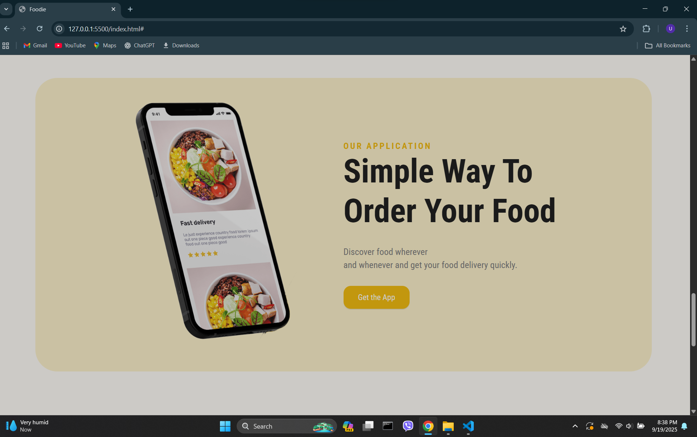

# Deployment : 
[https://food-delivery-responsive-website-omega.vercel.app/]

<h2>Output</h2>

  
  
  
  
  
  

<h3>CSS</h3>
<ul>
  <li>Font Family - Roboto Condensed</li>
  <li>.wrapper - padding-inline: 1.5rem</li>
  <li>Sign in &-nbsp; icons --> creates gap </li>
  <li>.cart-value - aspect-ratio:1</li>
  <li>@media screen and (max-width: 780px){}</li>
  <li>box-shadow: rgba(0, 0, 0, 0.05) 8px 8px  8px, rgba(0, 0, 0, 0.05) 8px 8px 8px inset;</li>
  <li>.content,.image-container{flex: 1;}</li>
  <li>margin-block: 2rem;</li>
  <li>set the line height to width size to center items</li>
  <li>flex-wrap: wrap; and flex-basis: 300px;</li>
  <li>filter: drop-shadow();</li>
  <li>object-fit: cover;</li>
  <li>input[type="email"]{}</li>
  <li>inset: 0 0 0 auto;</li>
  <li>.cart-list::-webkit-scrollbar{}</li>
  <li>.item.slide-out{}</li>
  
</ul>

<h3>JavaScript</h3>
<ul>
  <li> --> loads the content first then JS </li>
  <li>(e)=>{e.preventDefault();} --> helps to remove default like reloading/refreshing page</li>
  <li>mobileMenu.classList.toggle('mobile-menu-active');</li>
</ul>

<h3>links</h3>
<ul>
  <li>Googel Fonts - Roboto Condensed - imports - .css</li>
  <li>font Awesome cdnjs - copy link tag - HTML-head  </li>
  <li>Swiper js - get started - CDN - copy link - HTML-head</li>
  <li>Swiper js - get started - CDN - copy script - HTML-body</li>
  <li>Swiper js - get started - Resources - Demos</li>
</ul>